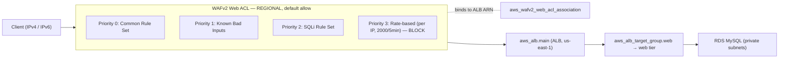

# Design Document: WAF Protection

## Overview

This feature adds AWS WAFv2 protection in front of the existing internet-facing Application Load Balancer (`aws_alb.main`) in the `persistent/` Terraform layer. A regional Web ACL inspects every HTTP(S) request reaching the ALB, layering three AWS-managed rule groups (common web exploits, known-bad inputs, SQL injection) and one rate-based rule (per-client-IP flood control). CloudWatch metrics and sampled requests are enabled on the Web ACL and on every rule so blocking behavior is observable and explainable.

All WAF resources live in `persistent/waf.tf` because they protect the long-lived ALB and must share its lifecycle — they should not be torn down with the ephemeral layer (addresses the structure.md layering rule and Requirement 1/7). The change is purely additive: a clean `terraform plan` in `persistent/` currently shows 29 adds / 0 destroys, and WAF adds only `create` actions with zero destroys and zero in-place updates to `aws_alb.main` (Requirement 11).

Design priorities, in order: **security** (defense-in-depth at the edge), **cost** (near-zero, ~$9/month baseline), **readability** (interview-explainable), then features.

### Requirement coverage summary

| Requirement | Addressed by |
|---|---|
| 1 — Regional Web ACL in persistent layer | `aws_wafv2_web_acl.main`, `scope = REGIONAL`, `default_action = allow` |
| 2 — Common Rule Set | managed rule group `AWSManagedRulesCommonRuleSet`, vendor `AWS`, `override_action = none` |
| 3 — Known Bad Inputs | managed rule group `AWSManagedRulesKnownBadInputsRuleSet`, vendor `AWS`, `override_action = none` |
| 4 — SQLi Rule Set | managed rule group `AWSManagedRulesSQLiRuleSet`, vendor `AWS`, `override_action = none` |
| 5 — Threat coverage (exactly these three) | three managed rule group statements, no others |
| 6 — Rate-based rule per client IP | `rate_based_statement`, `aggregate_key_type = IP`, `limit = 2000`, `action = block` |
| 7 — Association to ALB | `aws_wafv2_web_acl_association` referencing `aws_alb.main.arn` and the Web ACL ARN |
| 8 — CloudWatch visibility | `visibility_config` on the ACL and every rule, metrics + sampling enabled, distinct metric names |
| 9 — Naming and tagging | `${var.project_name}-` prefix on name and `Name` tag; `default_tags` adds Project/ManagedBy |
| 10 — Agent safety | fmt/validate/init/plan only; apply/destroy are operator-run; bootstrap untouched |
| 11 — Verification | additive plan, zero destroys/replaces/in-place updates on prior resources |

## Architecture



Request flow: a client request hits the Web ACL first (via the association), is evaluated against the rules in priority order, and — if not blocked — is forwarded to the ALB, then the target group / web tier, which talks to the private RDS MySQL database. The association is a separate resource that binds the ACL to the existing ALB without modifying the ALB resource itself.

## Why each managed rule group (security rationale, interview-ready)

This is a containerized web tier fronting an RDS MySQL database. The three AWS-managed rule groups give layered, low-maintenance coverage of the most common ways such an app gets attacked. Descriptions are high-level and paraphrased from AWS documentation (not reproduced verbatim).

- **`AWSManagedRulesCommonRuleSet` (Core Rule Set / CRS)** — the broad baseline. It blocks common, OWASP-style web exploits: cross-site scripting (XSS) attempts, malformed or non-standard requests, oversized request bodies, and path-traversal patterns (`../`). **Attack class blocked:** generic web exploitation. **Why it matters here:** it's the first line of defense that catches the everyday, automated exploit traffic any public endpoint sees.
- **`AWSManagedRulesKnownBadInputsRuleSet`** — pattern-matches requests that are known to be invalid or tied to known exploits/CVEs: attempts to exploit disclosed vulnerabilities, JNDI/Log4j-style injection strings, and suspicious host-header values. **Attack class blocked:** known-bad request patterns and exploitation of known CVEs. **Why it matters here:** it stops opportunistic scanners probing for the specific vulnerabilities that get mass-exploited after public disclosure.
- **`AWSManagedRulesSQLiRuleSet`** — detects SQL injection patterns across request components (query string, body, cookies, headers). **Attack class blocked:** SQL injection. **Why it matters here:** the web tier fronts an RDS MySQL database, so SQLi is the highest-impact attack class — this group filters injection attempts before they can reach application code that talks to the database.

All three use `override_action = none`, meaning the rule group's own configured actions apply (the group actively blocks matches rather than only counting them). This satisfies Requirements 2–5.

## How the rate-based rule works and the chosen limit

A WAFv2 **rate-based statement** continuously counts requests per aggregated source IP over a trailing **5-minute (300-second) sliding window**. With `aggregate_key_type = IP`, each client IP (IPv4 or IPv6) is tracked independently. When an IP's count in the window exceeds the configured `limit`, WAF applies the rule's action (here, **`block`**) to all further requests from that IP; once the trailing-window count drops back to or below the limit, WAF stops blocking that IP automatically (Requirement 6.5 / 6.6 — no manual intervention).

**Chosen limit: `2000` requests per 5 minutes per IP.** Reasoning:

- 2000/5min is AWS's own commonly cited default and a defensible starting point for a small portfolio site.
- It is **low enough** to blunt volumetric floods and credential-stuffing from a single source, which is the threat the rule exists to address.
- It is **high enough** not to trip up legitimate users, including several real people sharing one public IP behind corporate NAT or carrier-grade NAT (CGNAT), where many clients egress from the same address.
- It is tunable: the value can be lowered if abuse is observed. A conservative rollout can first set the rule action to **COUNT** (observe traffic in CloudWatch without blocking), confirm legitimate traffic stays well under 2000/5min, then switch to **BLOCK**. This design ships with `block` directly because the site's baseline traffic is near zero, but the COUNT-first option is noted for interview discussion.

This satisfies Requirement 6 (one rate-based rule, aggregate by IP, 300-second window, numeric limit in range, action `block`).

## Monthly cost

AWS WAF standard pricing, region **us-east-1**. These are **approximate list prices that can change** — verify against the [AWS WAF pricing page](https://aws.amazon.com/waf/pricing/).

| Item | Unit price | Quantity | Monthly cost |
|---|---|---|---|
| Web ACL | $5.00 / web ACL / month | 1 | $5.00 |
| Rules | $1.00 / rule / month | 4 (3 managed groups + 1 rate-based) | $4.00 |
| Requests | $0.60 / 1M requests | ~0 (near-zero-traffic site) | ~$0.00 |
| **Total** | | | **≈ $9.00 / month + ~$0.60 per 1M requests** |

Notes:
- Each managed rule group counts as **one** rule for the per-rule charge; the AWS-vendor managed groups carry **no additional subscription fee** beyond that per-rule charge.
- The request charge is effectively $0 for a portfolio site with negligible traffic.
- **Cost-control tie-in:** the ~$9/month web ACL + rule charges accrue for as long as the Web ACL exists in the persistent layer. Destroying the stack when idle avoids request charges but does *not* avoid the monthly ACL/rule charges unless the WAF resources themselves are destroyed. $9/month is the deliberate, defensible cost of putting real security at the edge of a long-lived ALB.

## Association to the existing ALB (confirmation)

- The Web ACL is bound to the **existing** ALB (`aws_alb.main`) via a dedicated `aws_wafv2_web_acl_association` resource that references `aws_alb.main.arn` as `resource_arn` and the Web ACL ARN as `web_acl_arn` (Requirement 7).
- Because the ALB is **regional and internet-facing** in us-east-1, the Web ACL uses `scope = REGIONAL` (not `CLOUDFRONT`).
- The association is a **separate resource**: it does **not** produce an in-place update to `aws_alb.main`, so the plan stays additive (Requirement 11.4).
- **All WAF resources** (the Web ACL with inline rules, and the association) live in `persistent/waf.tf`. They protect the long-lived ALB and share its lifecycle, so they belong in the persistent layer and must not be destroyed alongside the ephemeral layer (structure.md, Requirement 1/7).

## Components and Interfaces

New file: **`persistent/waf.tf`**. No existing files are modified for functionality. (Optionally, an output may be added to `persistent/outputs.tf` — see Data Models.)

### `aws_wafv2_web_acl.main`

- `name = "${var.project_name}-web-acl"` (Requirement 9.1)
- `scope = "REGIONAL"` (Requirement 1.2)
- `default_action { allow {} }` (Requirement 1.3)
- `tags = { Name = "${var.project_name}-web-acl" }` (Requirement 9.2); `default_tags` adds `Project` and `ManagedBy`.
- Top-level `visibility_config` with `cloudwatch_metrics_enabled = true`, `sampled_requests_enabled = true`, `metric_name = "${var.project_name}-web-acl"` (Requirement 8.1).

Inline `rule` blocks (priority order defined below):

1. **Common Rule Set** — `override_action { none {} }`; `statement { managed_rule_group_statement { name = "AWSManagedRulesCommonRuleSet", vendor_name = "AWS" } }`; `visibility_config` metrics+sampling on, `metric_name = "${var.project_name}-common-rules"` (Requirements 2, 8.2).
2. **Known Bad Inputs** — `override_action { none {} }`; `managed_rule_group_statement { name = "AWSManagedRulesKnownBadInputsRuleSet", vendor_name = "AWS" }`; `metric_name = "${var.project_name}-known-bad-inputs"` (Requirements 3, 8.3).
3. **SQLi Rule Set** — `override_action { none {} }`; `managed_rule_group_statement { name = "AWSManagedRulesSQLiRuleSet", vendor_name = "AWS" }`; `metric_name = "${var.project_name}-sqli-rules"` (Requirements 4, 8.4).
4. **Rate-based rule** — `action { block {} }`; `statement { rate_based_statement { limit = 2000, aggregate_key_type = "IP" } }`; `metric_name = "${var.project_name}-rate-limit"` (Requirements 6, 8.5).

Notes on block semantics:
- Managed rule groups use an `override_action` block (`none` = let the group's own actions apply). Non-group rules like the rate-based rule use an `action` block (`block`). This distinction is intentional and is a common WAFv2 gotcha worth being able to explain.
- The rate-based statement's 300-second window is **fixed by AWS** for the standard rate-based statement; it is not a configurable field in the resource, which is why only `limit` and `aggregate_key_type` are set.

### `aws_wafv2_web_acl_association.main`

- `resource_arn = aws_alb.main.arn` (Requirement 7.2)
- `web_acl_arn = aws_wafv2_web_acl.main.arn` (Requirement 7.3)
- No tags argument (this resource does not support tags; Requirement 9.3 applies "where a resource supports tags").

### Rule priority ordering

| Priority | Rule | Action |
|---|---|---|
| 0 | Common Rule Set | group actions (block on match) |
| 1 | Known Bad Inputs | group actions (block on match) |
| 2 | SQLi Rule Set | group actions (block on match) |
| 3 | Rate-based (per IP) | block |

Managed groups are evaluated first (cheap, high-value signature matching), with the rate-based rule last. Priorities are distinct integers; lower numbers evaluate first. WAF stops at the first terminating action, so ordering is explicit and deterministic.

## Data Models

Terraform configuration only; no application data model. Inputs/outputs:

- **Inputs:** `var.project_name` (default `client-hosting`) for naming/tagging; `var.aws_region` (default `us-east-1`). No new variables are required — `limit = 2000` is a literal in the design, though it could be promoted to a variable later for tunability.
- **Reference:** `aws_alb.main.arn` (existing ALB in `persistent/alb.tf`).
- **Optional output (recommended, not required):** add `web_acl_arn` (and/or `web_acl_id`) to `persistent/outputs.tf` for observability and potential future consumers:
  ```hcl
  output "web_acl_arn" {
    value = aws_wafv2_web_acl.main.arn
  }
  ```
  This is additive and purely informational; it has no cost or lifecycle impact. Include it only if the operator wants the ARN surfaced in state outputs.

## Testing Strategy

### Why no property-based testing

This feature is **Infrastructure as Code** (declarative Terraform). It has no pure function with input/output behavior to quantify over, so property-based testing does not apply. The appropriate strategy is static validation plus a manual runtime check, below. (This follows the workflow's explicit guidance that IaC uses validate/plan expectations and manual verification rather than PBT.)

### Static verification (agent-runnable, read-only)

The agent runs only read-only commands (`fmt`, `validate`, `init`, `plan`) — Requirement 10.

1. `terraform fmt` — enforce canonical formatting (project convention).
2. `terraform validate` — MUST exit 0 with zero errors and zero warnings (Requirement 11.1).
3. `terraform plan` — expected results:
   - `aws_wafv2_web_acl.main`, its inline managed-rule-group statements, the rate-based rule, and `aws_wafv2_web_acl_association.main` all shown as **create** actions (Requirement 11.2).
   - **Zero destroy** and **zero replace** actions against pre-existing resources (Requirement 11.3).
   - **Zero update-in-place** against pre-existing resources, including `aws_alb.main` (Requirement 11.4).
   - Overall count increases from 29 adds to 29 + N (N = WAF resources), still **0 destroys**.
4. **Halt condition:** if `plan` reports any destroy or replace against prior resources, the agent halts before any apply step and reports the count and resource addresses, retaining the plan output unmodified (Requirements 10.4, 11.5).

### Runtime verification (operator, manual, after apply)

Requirement 6's blocking behavior (Req 6.5 / 6.6) cannot be exercised by `validate` or `plan` — those are static and never send traffic. After the **operator** applies, blocking is validated manually with live traffic:
- Confirm the Web ACL is associated with the ALB in the console / via `aws wafv2 get-web-acl-for-resource`.
- Generate a benign burst above 2000 requests/5min from a single IP and confirm the rate-based rule starts returning 403 (blocked), then confirm requests succeed again after the burst subsides.
- Inspect CloudWatch metrics and sampled requests for each rule (enabled per Requirement 8) to confirm counters move as expected.

### Agent safety / apply ownership

- The agent performs **only** `fmt`, `validate`, `init`, `plan` and never `apply`, `destroy`, `import`, or `state` operations (Requirement 10.1–10.2, 10.5).
- The agent leaves everything under `bootstrap/` unmodified (Requirement 10.3).
- **`terraform apply` is operator-run.** The agent never applies or destroys; it hands a reviewed, additive plan to the operator, who performs the apply and the runtime verification above.

## Error Handling

- **Invalid managed rule group / vendor name:** caught at `plan`/apply by the AWS provider. Names and `vendor_name = "AWS"` are set exactly per Requirements 2–5.
- **Duplicate or missing rule priorities:** WAFv2 requires distinct priorities; the design assigns 0–3. `validate`/`plan` surfaces conflicts.
- **Rate limit out of range:** `limit = 2000` is within the allowed 100–2,000,000,000 range (Requirement 6.3).
- **Association to a non-existent/wrong-scope resource:** mitigated by referencing `aws_alb.main.arn` directly (a regional ALB) with a `REGIONAL` ACL; a scope/ARN mismatch would fail at apply, not silently.
- **Unexpected destroy/replace in plan:** treated as a halt condition (Requirements 10.4, 11.5) — the agent stops and defers to the operator rather than proceeding.
