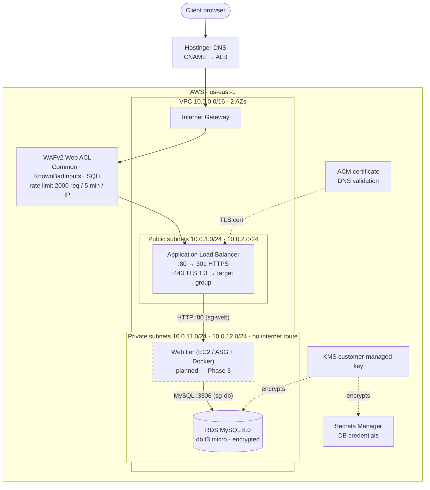
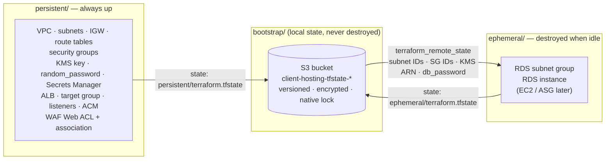

# Client Hosting IaC

Reproducible, secured hosting for client websites on AWS, written in Terraform.

**Before:** every new client meant hand-building a VPS: provisioning, NGINX, SSL, firewall rules and deployment. It was slow, error-prone and different every time.
**After:** a complete, secured environment comes up from Terraform and can be torn down cleanly when it's idle.

> Status: work in progress. The code is written and `terraform validate` passes in both layers. Nothing has been applied yet. See [PHASES#1](PHASES%231) for the roadmap.

---

## Architecture



### Security groups (each tier only accepts the one in front of it)

| Tier | Security group | Inbound | Outbound |
|---|---|---|---|
| 1 · Edge | `alb-sg` | 80/443 from `0.0.0.0/0` | 80 → `web-sg` |
| 2 · Web | `web-sg` | 80 from `alb-sg` | 3306 → `db-sg`, 443 → internet (image pulls) |
| 3 · Data | `db-sg` | 3306 from `web-sg` | none |

Rules reference other security groups by ID rather than CIDR, so a tier is reachable only from the tier in front of it. RDS sits in private subnets with no route to the internet gateway, so it can't be reached from outside whatever the firewall rules say.

> **Known issue (to fix before apply):** `alb_https` in `persistent/security-groups.tf` is declared as an *ingress* rule from `web-sg` on port 80, but it was meant to be the ALB's egress to the web tier. So right now `alb-sg` has no 443 inbound and no outbound to `web-sg`. The table above shows the intended design.

---

## Lifecycle layers

The infrastructure is split by **lifecycle**: some resources should live forever, and others should only exist while you're using them.



| Layer | What lives there | Why |
|---|---|---|
| `bootstrap/` | S3 state bucket | Its state is separate, so destroying an environment can never delete the backend that tracks it. |
| `persistent/` | Network, SGs, KMS, secrets, ALB, ACM, WAF | KMS keys have a 7-day deletion window and break destroy/recreate. The ALB's DNS name changes when it's recreated, which breaks the manual CNAME at Hostinger. |
| `ephemeral/` | RDS (later EC2/ASG) | This is the compute that costs money. It is destroyed whenever the stack isn't being used. |

`ephemeral/` never references `persistent/` resources directly. It reads only these outputs through `data.terraform_remote_state.persistent`:

| Output | Used for |
|---|---|
| `private_subnet_ids` | RDS subnet group |
| `db_security_group_id` | RDS `vpc_security_group_ids` |
| `kms_key_arn` | RDS storage encryption |
| `db_password` *(sensitive)* | RDS master password |

`persistent/` also exports `vpc_id`, `public_subnet_ids`, `web_security_group_id`, `target_group_arn`, `alb_dns_name` and `acm_validation_record`, for the web tier and for DNS setup.

---

## Repository layout

```
bootstrap/     S3 remote-state backend (own local state, not modified)
persistent/    acm.tf · alb.tf · network.tf · secrets.tf · security-groups.tf · waf.tf
               outputs.tf · variables.tf · terraform.tf
ephemeral/     database.tf · variables.tf · terraform.tf (backend + remote state)
.kiro/         specs (lifecycle-split, waf-protection, container-web-tier) and steering rules
PHASES#1       roadmap and per-phase status
Comments.md    lessons learned
```

---

## Usage

Requirements: Terraform ≥ 1.10 (for S3 native locking), AWS provider 5.42.0, and AWS credentials for `us-east-1`.

Apply **persistent first**, because ephemeral reads its outputs:

```bash
# 1. Long-lived layer
cd persistent
terraform init
terraform plan
terraform apply

# Add the ACM validation CNAME and the app CNAME at your DNS provider
terraform output acm_validation_record
terraform output alb_dns_name

# 2. Disposable layer
cd ../ephemeral
terraform init
terraform plan
terraform apply

# When idle: destroy only the expensive layer
terraform destroy
```

---

## Security

- Encryption at rest uses a customer-managed KMS key with rotation enabled, for both RDS and the secret.
- The DB password comes from `random_password` and is stored in Secrets Manager. It never appears in a `.tfvars` file or in git.
- RDS is never publicly accessible.
- WAFv2 sits in front of the ALB with three AWS managed rule groups and a per-IP rate limit.
- The ALB redirects HTTP to HTTPS, terminates TLS with policy `ELBSecurityPolicy-TLS13-1-2-2021-06`, and drops invalid header fields.
- `.tfstate`, `.tfvars` and `.terraform/` are git-ignored. Remote state is encrypted, and concurrent applies are prevented by S3 native locking.

## Cost

The code is the product: the infrastructure doesn't need to run all the time.

- `ephemeral/` (RDS) is destroyed whenever it isn't in use.
- The NAT gateway (about $32/month) is disabled by default. VPC endpoints are the planned cheaper option.
- RDS and EC2 use free-tier sizes (`db.t3.micro`, `t3.micro`), with backup retention of 1 day.
- **These persistent resources cost money while they exist:** the ALB is billed hourly (roughly $16+/month plus public IPv4), and WAF is about $9/month for the Web ACL and 4 rules. Both are kept up on purpose so the DNS name stays stable and the edge stays protected. Destroy `persistent/` too if the project is paused for a long time.
- Billing alarms are set at $5 and $20.

## Roadmap

| Phase | | Status |
|---|---|---|
| 0 | Remote state (S3 + native locking) | ✅ |
| 1 | Networking (VPC, 2 AZs, public/private subnets) | ✅ |
| 2 | 3-tier SGs, KMS, RDS, Secrets Manager, ALB + ACM, WAF | 🔨 written, not applied |
| 3 | Containerization: ECR, Docker, EC2/ASG web tier | 📝 specced |
| 4 | Modules + dev/prod environments | |
| 5 | CI/CD: fmt/validate/plan + tfsec/checkov gating | |
| 6 | Observability: CloudWatch dashboards and alarms | |
| 7 | IAM Identity Center (short-lived credentials) | |
| 8 | Migration to HCP Terraform | |
| 9 | Documentation: DECISIONS.md and walkthrough | |
